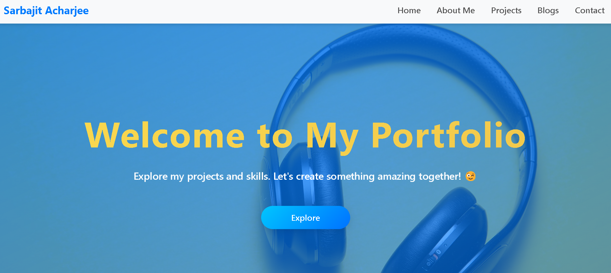
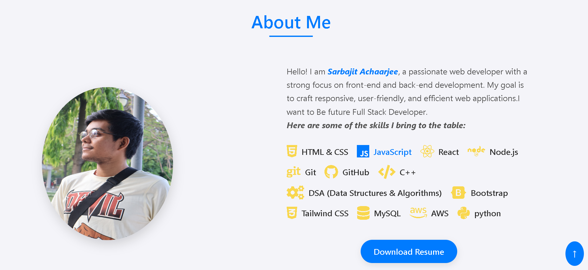
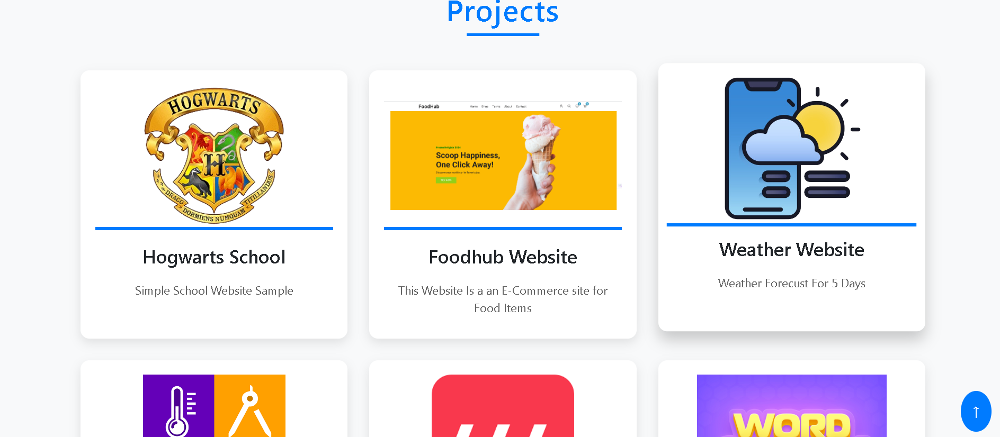
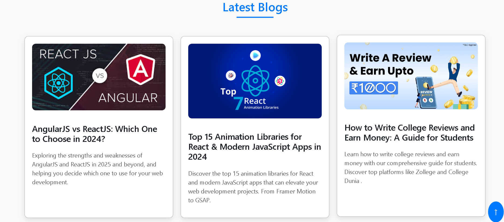
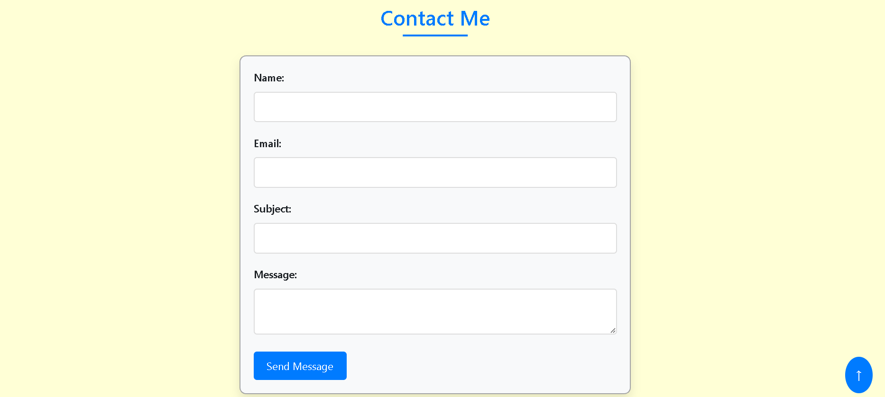

# Personal Portfolio Website

Welcome to my personal portfolio website! This is a responsive, modern web portfolio showcasing my projects, skills, and experiences as a web developer. The website is built using HTML, CSS, and JavaScript, and includes modern animations, smooth scrolling, and responsive design principles.

## Table of Contents

- [Personal Portfolio Website](#personal-portfolio-website)
  - [Table of Contents](#table-of-contents)
  - [Features](#features)
  - [Technologies Used](#technologies-used)
  - [Demo \& Screenshots](#demo--screenshots)
    - [Screenshots](#screenshots)

## Features

- **Responsive Design**: Works across devices with different screen sizes, from mobile phones to desktop screens.
- **Smooth Scrolling Animations**: Added subtle scroll animations for various sections like About and Projects.
- **Interactive Projects Section**: Displays a list of projects with hover effects and animations.
- **Resume Download**: Download resume button in the "About Me" section.
- **Modern CSS and Flexbox Layout**: Utilizes modern CSS features such as Flexbox and CSS Grid for layout management.
- **Custom Animations**: Includes unique animations like scale-up, opacity, and fade effects.

## Technologies Used

- HTML5
- CSS3 (Flexbox, Grid, Media Queries)
- JavaScript (for Scroll Animations)
- FontAwesome (for icons)
- Git/GitHub (for version control)

## Demo & Screenshots

- **Live Demo**: [Demo Link](https://github-sarbajitacharjee-scifor.vercel.app/)
  
### Screenshots

1. **Home Section**
   

2. **About Section**
   

3. **Projects Section**
   
4. **Blogs Section**
   
5. **Contact Section**
   
